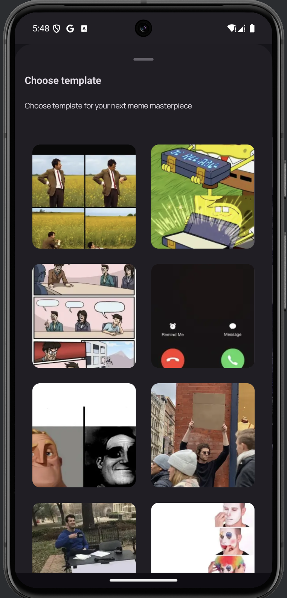

# Master Meme
## **About the App**
Master Meme is your ultimate meme-making playground! Pick from a wide collection of hilarious meme templates, add your own customized text, and adjust the size with an easy to use slider for the perfect look. Once your masterpiece is ready, save it to your device or instantly share it on your favorite social media platforms. Unleash your creativity and make the internet laugh one meme at a time!

## **Screenshots**
<table>
  <tr>
    <td>
       
      <b>Meme List Empty Screen</b>
    </td>
    <td>
       
      <b>Meme Templates Bottom Sheet Dialog</b>
    </td>
    <td>
       
      <b>Meme Editor Screen</b>
    </td>
    <td>
       
      <b>Meme Editor Screen - Edit Text</b>
    </td>
    <td>
       
      <b>Meme Editor Screen - Save or Share Meme</b>
    </td>
    <td>
       
      <b>Meme List Screen</b>
    </td>
  </tr>
</table>

## Technologies
- **UI**: Jetpack Compose
- **Reactive Programming**: Kotlin Flows
- **Asynchronous Programming**: Coroutines
- **Dependency Injection**: Koin
- **Navigation**: Jetpack Navigation
- **Local Storage**: Room DB
- **Architecture**: MVI

## Future Work

- Implement functionality to add memes to favorites
- Enable selection of multiple memes for batch deletion
- Add the ability to share all selected memes at once
- Provide an option to update the font style in the text editor
- Integrate a color picker for customizing text colors
- Allow users to search for memes within the templates

